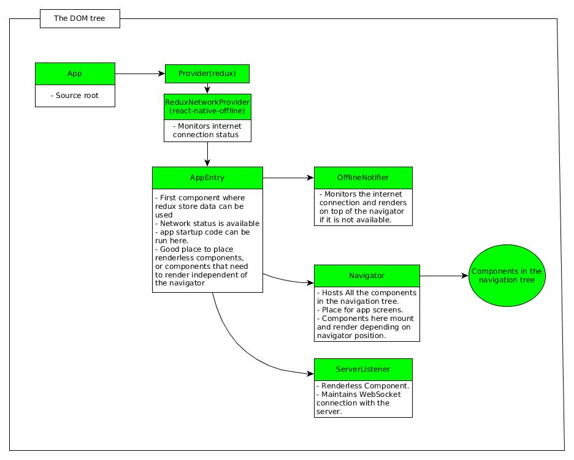

# Basic overview

## DOM Root structure:

## Navigation

Rest of the React components are in the navigation tree,
or generally used by components in it. [React Navigation](https://reactnavigation
- Navigator components are screens in the app
- Navigator components always receive the prop: navigation

Moving from one component to another is usually simple: just call:
- props.navigation.navigate('Component_Name_In_The_Navigation_Tree')

Give props with navigation:
- props.navigation.navigate('Component_Name_In_The_Navigation_Tree', { parameterName: {})

Get navigation parameters:
- props.navigation.getParam('parameterName')

Navigation directly to a component anywhere in the whole tree is usually possible
unless this is expressly prohibited.

The structure of the navigator is defined in:
- root:	src/Navigator.js
- various component folders: index.js

## Used Libraries

#### redux-thunk
- Allows asynchronic logic with the store.

#### react-native-offline
- Monitors internet availability.
- Can be used to queue sending requests until internet becomes available.

Implemented queuing requests on some reducer functions.

Used to notify the user if the internet is not available.(OfflineNotifier.js)

(Internet availability check is done on a general ping server, not on the app backend)

#### axios-retry
- Allows retrying unanserved requests for a given amount of time

Mostly used to wake up Heroku, but may increase general reliability of communication, if
the backend answers slowly for some reason.

May also unnecessarily stress the backend though, if it is moved from heroku.

#### socket.io
- Implements websocket connections
- Reconnects automatically if connection drops! (Necessary with heroku backend)

When the user logs in. A websocket connection is formed with the backend(ServerListener.js)
Server sends updates through the websocket connection. Currently sends:
- new messages(invites) that have been send to the user
- Updated events. When someone updates an event the user participates in.

#### Other libraries you may need to get accuinted to:
- react-native
- react-native-elements
- react-native-maps-super-cluster
- luxon

